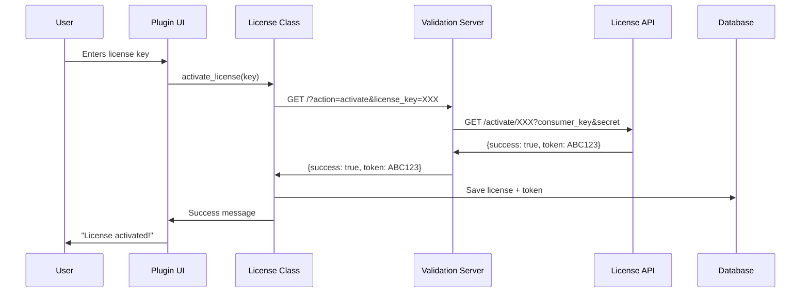
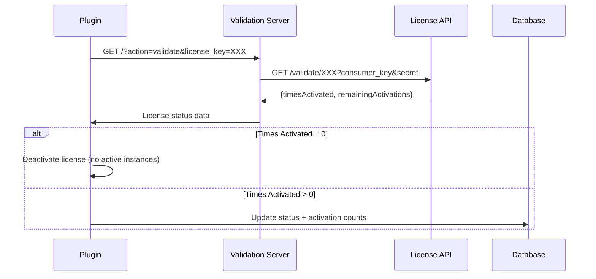
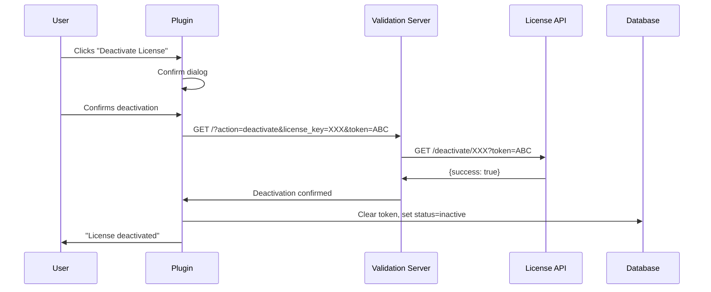

# Adaire Blocks License Validation System

## TL;DR

**What it does:** Secure license activation system that protects API credentials by using a server-side proxy.

**How it works:**
1. User enters license key in WordPress admin
2. Plugin sends request to Validation Server (our secure proxy)
3. Validation Server adds credentials and forwards to License API
4. License API returns activation token
5. Plugin stores token locally and unlocks premium features

**Key Components:**
- **WordPress Plugin** → Client-side license UI and management
- **Validation Server** → Secure proxy at `https://adaireblocks.com/validation-server/`
- **License API** → WooCommerce License Manager on main site

**Security:** API credentials (consumer key/secret) never exposed to client. All communication over HTTPS with cryptographically signed tokens.

**Validation:** Automatic 24-hour checks, manual validation button, 7-day grace period for offline sites.

**Limitations:** Users with server file access can bypass checks by modifying PHP code (mitigated with multiple validation points and regular server checks).

---

## Overview

The Adaire Blocks license validation system is a secure, server-side license management solution that protects API credentials while enabling license activation, validation, and deactivation for the WordPress plugin.

**Key Benefits:**
- ✅ API credentials never exposed to client-side code
- ✅ Centralized license validation through dedicated server
- ✅ Supports multiple site activations per license
- ✅ Automatic validation every 24 hours
- ✅ Grace period for offline validation

---

## System Architecture

### High-Level Architecture Diagram

```
┌─────────────────────┐
│  WordPress Plugin   │
│  (Client Site)      │
│                     │
│  ┌───────────────┐  │
│  │ License Page  │  │
│  │   (UI)        │  │
│  └───────┬───────┘  │
│          │          │
│          ▼          │
│  ┌───────────────┐  │
│  │ License Class │  │
│  │   (PHP)       │  │
│  └───────┬───────┘  │
└──────────┼──────────┘
           │ HTTPS
           │
           ▼
┌──────────────────────┐
│  Validation Server   │
│  (adaireblocks.com)    │
│                      │
│  ┌────────────────┐  │
│  │  index.php     │  │
│  │  (Proxy)       │  │
│  └────────┬───────┘  │
│           │          │
│           ▼          │
│  ┌────────────────┐  │
│  │  License API   │  │
│  │  (WooCommerce) │  │
│  └────────────────┘  │
└──────────────────────┘
           │
           ▼
┌──────────────────────┐
│  License Manager     │
│  (WordPress.com)     │
│                      │
│  - License Keys      │
│  - Activations       │
│  - Tokens            │
└──────────────────────┘
```

**[INSERT ARCHITECTURE SCREENSHOT HERE]**

---

## System Components

### 1. WordPress Plugin (Client)

**Location:** `adaire-blocks-dev2/`

**Key Files:**
- `includes/class-adaire-blocks-license.php` - Main license management class
- `includes/class-adaire-blocks-validation-config.php` - Configuration for validation server URL
- `admin/license-page.php` - Admin UI for license management
- `admin/js/license-page.js` - Frontend JavaScript for AJAX calls

**Responsibilities:**
- Displays license management UI in WordPress admin
- Sends license requests to validation server
- Stores license data locally (encrypted tokens)
- Validates licenses every 24 hours
- Checks license status for premium features

### 2. Validation Server (Proxy)

**Location:** `Validation server/`  
**Deployed at:** `https://adaireblocks.com/validation-server/`

**Key Files:**
- `adaire-validation-server.php` - WordPress plugin wrapper
- `index.php` - Main validation server logic

**Responsibilities:**
- Receives license requests from WordPress plugins
- Securely stores API credentials (consumer key/secret)
- Proxies requests to WooCommerce License Manager API
- Handles CORS for cross-origin requests
- Logs all operations for debugging
- Returns formatted responses to plugin

### 3. License API (WooCommerce)

**Hosted by:** License Manager for WooCommerce (LMFWC)  
**Endpoint:** `https://adaire.dev/ad/wp-json/lmfwc/v2/licenses/`

**Responsibilities:**
- Manages license keys and activations
- Enforces activation limits
- Generates activation tokens
- Tracks license usage
- Validates license authenticity

---

## License Operations Flow

### 1. License Activation

**User Journey:**

**[INSERT ACTIVATION UI SCREENSHOT HERE]**



**Step-by-Step Process:**

1. **User Input:** User enters license key in WordPress admin
2. **Client Validation:** Plugin validates key format
3. **AJAX Request:** JavaScript sends activation request to validation server
   ```javascript
   fetch(validationServerUrl + '/?action=activate&license_key=' + licenseKey)
   ```

4. **Validation Server Processing:**
   - Receives request with license key
   - Appends secure consumer credentials
   - Makes authenticated request to License API
   - Returns response to plugin

5. **Token Storage:**
   - Plugin receives activation token
   - Stores in WordPress database: `wp_adaire_blocks_licenses`
   - Token is used for future validation/deactivation

6. **Status Update:**
   - License status set to "active"
   - Activation count incremented
   - Premium features unlocked

**Database Table Structure:**
```sql
CREATE TABLE wp_adaire_blocks_licenses (
    id mediumint(9) NOT NULL AUTO_INCREMENT,
    license_key varchar(255) NOT NULL,
    activation_token varchar(255) DEFAULT NULL,
    status varchar(20) DEFAULT 'inactive',
    times_activated int(11) DEFAULT 0,
    times_activated_max int(11) DEFAULT 0,
    remaining_activations int(11) DEFAULT 0,
    last_checked datetime DEFAULT NULL,
    created_at datetime DEFAULT CURRENT_TIMESTAMP,
    updated_at datetime DEFAULT CURRENT_TIMESTAMP ON UPDATE CURRENT_TIMESTAMP,
    PRIMARY KEY (id),
    UNIQUE KEY license_key (license_key)
);
```

---

### 2. License Validation

**Triggered by:**
- Every 24 hours (automatic background check)
- Manual "Validate License" button click
- Plugin load (if last check > 24 hours)

**[INSERT VALIDATION STATUS SCREENSHOT HERE]**



**Validation Logic:**

1. **Check Frequency:** Plugin checks if last validation > 24 hours
2. **Send Request:** Makes validation request to server
3. **Receive Data:**
   ```json
   {
     "success": true,
     "data": {
       "timesActivated": 3,
       "timesActivatedMax": 5,
       "remainingActivations": 2
     }
   }
   ```

4. **Update Database:** Saves latest activation counts
5. **Status Decision:**
   - If `timesActivated` = 0 → Deactivate locally (license revoked remotely)
   - If `timesActivated` > 0 → Keep active, update counts

---

### 3. License Deactivation

**User Journey:**

**[INSERT DEACTIVATION UI SCREENSHOT HERE]**



**Deactivation Process:**

1. **User Action:** Clicks deactivate button (with confirmation)
2. **Send Request:** Includes both license key and activation token
3. **Server Processing:**
   - Validation server forwards to License API
   - API removes activation record
   - Frees up activation slot

4. **Local Cleanup:**
   - Clear `activation_token` from database
   - Set `status` to 'inactive'
   - Premium features disabled

5. **Result:**
   - License can be activated elsewhere
   - Activation count decremented

---

## API Endpoints

### Validation Server Endpoints

**Base URL:** `https://adaireblocks.com/validation-server/`

#### 1. Health Check
```
GET /?action=health
```

**Response:**
```json
{
  "success": true,
  "data": {
    "status": "healthy",
    "timestamp": "2024-01-15 10:30:00",
    "php_version": "8.1.0",
    "curl_available": true,
    "license_api_connectivity": {
      "reachable": true,
      "http_code": 200
    }
  }
}
```

**[INSERT HEALTH CHECK SCREENSHOT HERE]**

---

#### 2. Activate License
```
GET /?action=activate&license_key={LICENSE_KEY}
```

**Parameters:**
- `action` (required): "activate"
- `license_key` (required): The license key to activate

**Success Response:**
```json
{
  "success": true,
  "data": {
    "token": "abc123def456...",
    "timesActivated": 1,
    "timesActivatedMax": 5,
    "remainingActivations": 4
  }
}
```

**Error Response:**
```json
{
  "success": false,
  "error": "Activation limit reached",
  "data": {
    "errors": {
      "lmfwc_rest_data_error": [
        "Maximum activation count (5) reached for the license key."
      ]
    }
  }
}
```

---

#### 3. Validate License
```
GET /?action=validate&license_key={LICENSE_KEY}
```

**Parameters:**
- `action` (required): "validate"
- `license_key` (required): The license key to validate

**Success Response:**
```json
{
  "success": true,
  "data": {
    "timesActivated": 3,
    "timesActivatedMax": 5,
    "remainingActivations": 2
  }
}
```

---

#### 4. Deactivate License
```
GET /?action=deactivate&license_key={LICENSE_KEY}&token={ACTIVATION_TOKEN}
```

**Parameters:**
- `action` (required): "deactivate"
- `license_key` (required): The license key
- `token` (required): Activation token from initial activation

**Success Response:**
```json
{
  "success": true,
  "data": {
    "message": "License deactivated successfully"
  }
}
```

---

## Code Implementation

### Plugin: Checking License Status

**File:** `adaire-blocks.php`

```php
/**
 * Check if premium features are available
 */
function adaire_blocks_is_premium_available() {
    $license_manager = AdaireBlocksLicense::get_instance();
    return $license_manager->is_license_active();
}

// Usage in blocks
if (adaire_blocks_is_premium_available()) {
    // Enable premium features
    register_premium_block();
}
```

---

### Plugin: License Activation (PHP)

**File:** `includes/class-adaire-blocks-license.php`

```php
public function activate_license($license_key) {
    // Build validation server URL
    $url = $this->validation_server_url . 
           '/?action=activate&license_key=' . urlencode($license_key);
    
    // Make HTTP request
    $response = wp_remote_get($url, array(
        'timeout' => 30,
        'headers' => array(
            'Accept' => 'application/json',
            'User-Agent' => 'Adaire-Blocks-WordPress/1.1.1'
        )
    ));
    
    // Parse response
    $body = wp_remote_retrieve_body($response);
    $data = json_decode($body, true);
    
    if ($data['success']) {
        // Save to database
        $this->save_license_data($license_key, array(
            'activation_token' => $data['data']['token'],
            'status' => 'active',
            'times_activated' => $data['data']['timesActivated'],
            'times_activated_max' => $data['data']['timesActivatedMax'],
            'remaining_activations' => $data['data']['remainingActivations']
        ));
        
        return array('success' => true, 'message' => 'License activated successfully');
    }
    
    return array('success' => false, 'message' => 'Activation failed');
}
```

---

### Validation Server: Request Processing

**File:** `Validation server/index.php`

```php
/**
 * Make authenticated request to license API
 */
function makeLicenseRequest($endpoint, $method = 'GET') {
    global $config;
    
    // Build authenticated URL
    $url = $config['base_url'] . $endpoint;
    $url .= '?consumer_key=' . urlencode($config['consumer_key']);
    $url .= '&consumer_secret=' . urlencode($config['consumer_secret']);
    
    // Make request with cURL
    $ch = curl_init();
    curl_setopt_array($ch, [
        CURLOPT_URL => $url,
        CURLOPT_RETURNTRANSFER => true,
        CURLOPT_TIMEOUT => 30,
        CURLOPT_HTTPHEADER => [
            'Accept: application/json',
            'User-Agent: Adaire-Blocks-Validation-Server/1.0'
        ]
    ]);
    
    $response = curl_exec($ch);
    $http_code = curl_getinfo($ch, CURLINFO_HTTP_CODE);
    curl_close($ch);
    
    return [
        'success' => $http_code >= 200 && $http_code < 300,
        'data' => json_decode($response, true)
    ];
}

/**
 * Handle incoming requests
 */
$action = $_GET['action'] ?? '';
$license_key = $_GET['license_key'] ?? '';

switch ($action) {
    case 'activate':
        $result = makeLicenseRequest('activate/' . $license_key);
        break;
    case 'validate':
        $result = makeLicenseRequest('validate/' . $license_key);
        break;
    case 'deactivate':
        $token = $_GET['token'] ?? '';
        $result = makeLicenseRequest('deactivate/' . $license_key . '?token=' . $token);
        break;
}

echo json_encode($result);
```

---

## Configuration

### Changing the Validation Server URL

**File:** `includes/class-adaire-blocks-validation-config.php`

```php
class AdaireBlocksValidationConfig {
    /**
     * Validation server base URL
     * Change this to point to your validation server
     */
    const VALIDATION_SERVER_URL = 'https://adaireblocks.com/validation-server';
    
    public static function get_validation_server_url() {
        return self::VALIDATION_SERVER_URL;
    }
}
```

**This single change updates:**
- ✅ All PHP license API calls
- ✅ JavaScript AJAX requests
- ✅ Admin page displays
- ✅ Test/debug methods

### Validation Server Configuration

**File:** `Validation server/index.php`

```php
$config = [
    'consumer_key' => 'ck_5a9271d84ab660911a7c48dfd3f89e1691d9e286',
    'consumer_secret' => 'cs_d92b496a59e64042539c7e6eb14f17697d347827',
    'base_url' => 'https://adaire.dev/ad/wp-json/lmfwc/v2/licenses/',
    'timeout' => 30
];
```

**⚠️ Security Note:** These credentials should **NEVER** be exposed in client-side code.

---

## Security Considerations

### What's Protected
1. **API Credentials:** Consumer key/secret never leave the validation server
2. **Activation Tokens:** Cryptographically signed tokens from License Manager
3. **Database Storage:** Tokens stored securely in WordPress database
4. **HTTPS Only:** All communications encrypted in transit

### Known Limitations
1. **Client-Side Bypass:** Users with file access can modify PHP code
2. **Token Theft:** If someone gains database access, they can copy tokens
3. **Offline Grace Period:** Licenses work for 7 days without validation

### Mitigation Strategies
1. **Multiple Validation Points:** Check license in multiple places throughout code
2. **Regular Revalidation:** 24-hour automatic checks
3. **Server-Side Enforcement:** Validation server can revoke licenses instantly
4. **Token Expiry:** Tokens can be invalidated remotely
5. **Activation Limits:** Prevents unlimited distribution

### Best Practices
- ✅ Always validate on plugin activation
- ✅ Check license status before registering premium blocks
- ✅ Log license validation failures
- ✅ Provide clear user messaging for expired licenses
- ✅ Use grace periods to avoid false positives from network issues

---

## Admin UI Screenshots

### License Page (Inactive State)

**[INSERT INACTIVE LICENSE PAGE SCREENSHOT HERE]**

Shows:
- License key input field
- Activate button
- Status: Inactive
- Help information

---

### License Page (Active State)

**[INSERT ACTIVE LICENSE PAGE SCREENSHOT HERE]**

Shows:
- Status badge: Active
- Remaining activations: X / Y
- Times activated count
- Last checked timestamp
- Validate/Deactivate buttons

---

### Activation Success Message

**[INSERT SUCCESS MESSAGE SCREENSHOT HERE]**

Shows:
- Green success notification
- Updated license information
- Active status badge

---

### Activation Limit Error

**[INSERT ACTIVATION LIMIT ERROR SCREENSHOT HERE]**

Shows:
- Red error notification
- "Maximum activation count reached" message
- Current activation count

---

## Debugging & Testing

### Debug Mode Features

When `WP_DEBUG` is enabled, additional tools appear:

**[INSERT DEBUG TOOLS SCREENSHOT HERE]**

- **Test API:** Validates server connectivity
- **Test Auth:** Tests authentication with License Manager
- **Health Check:** Checks validation server status

### Server Logs

**Location:** `wp-content/debug.log`

**Example Log Entries:**
```
[2024-01-15 10:30:15] Adaire Blocks License: Starting license activation via validation server
[2024-01-15 10:30:15] Adaire Blocks License: License Key: abc123de...
[2024-01-15 10:30:16] Adaire Blocks License: Response Code: 200
[2024-01-15 10:30:16] Adaire Blocks License: License activation successful
```

### Common Issues & Solutions

| Issue | Cause | Solution |
|-------|-------|----------|
| "Network error" | Validation server unreachable | Check server status, verify URL |
| "Invalid JSON response" | Server returning HTML/error page | Check server logs, verify endpoint |
| "Activation limit reached" | All slots used | Deactivate unused sites |
| "License validation failed" | Expired or invalid license | Contact support |

---

## Deployment Checklist

### Initial Setup
- [ ] Deploy validation server to `https://adaireblocks.com/validation-server/`
- [ ] Configure WooCommerce License Manager on main site
- [ ] Set up consumer key/secret in validation server
- [ ] Test health check endpoint
- [ ] Test activation/deactivation flow

### Plugin Distribution
- [ ] Update `VALIDATION_SERVER_URL` in config file
- [ ] Remove development bypass code
- [ ] Test on fresh WordPress install
- [ ] Verify license activation works
- [ ] Verify premium features unlock correctly

### Monitoring
- [ ] Set up server monitoring for validation endpoint
- [ ] Monitor activation API logs
- [ ] Track failed validation attempts
- [ ] Review unusual activation patterns

---

## Support & Troubleshooting

### For Users
**Email:** support@adaireblocks.com

**Common Questions:**
1. How many sites can I activate? → Check license type (varies by plan)
2. Can I transfer my license? → Yes, deactivate from old site first
3. What happens if I exceed activations? → You'll need to deactivate an existing site
4. How often is my license validated? → Automatically every 24 hours

### For Developers

**Validation Server Issues:**
```bash
# Check server status
curl https://adaireblocks.com/validation-server/?action=health

# Test activation (replace with real key)
curl "https://adaireblocks.com/validation-server/?action=activate&license_key=ABC123"
```

**Plugin Debug Mode:**
1. Enable WP_DEBUG in wp-config.php
2. Check wp-content/debug.log for errors
3. Use "Test API" button in admin
4. Review AJAX network requests in browser console

---

## Version History

| Version | Date | Changes |
|---------|------|---------|
| 1.0.0 | 2024-01-15 | Initial release with validation server |
| 1.1.0 | 2024-01-20 | Added health check endpoint |
| 1.1.1 | 2024-01-25 | Improved error handling and logging |

---

## Related Documentation

- [Free vs Premium Feature Management](FREE-PREMIUM-MANAGEMENT.md)
- [Premium Licensing Guide](PREMIUM_LICENSING_GUIDE.md)
- [License System Summary](LICENSE_SYSTEM_SUMMARY.md)
- [Validation Server Configuration](../Validation%20server/CONFIGURATION.md)

---

**Document Version:** 1.0  
**Last Updated:** January 2024  
**Maintained by:** Adaire Development Team

